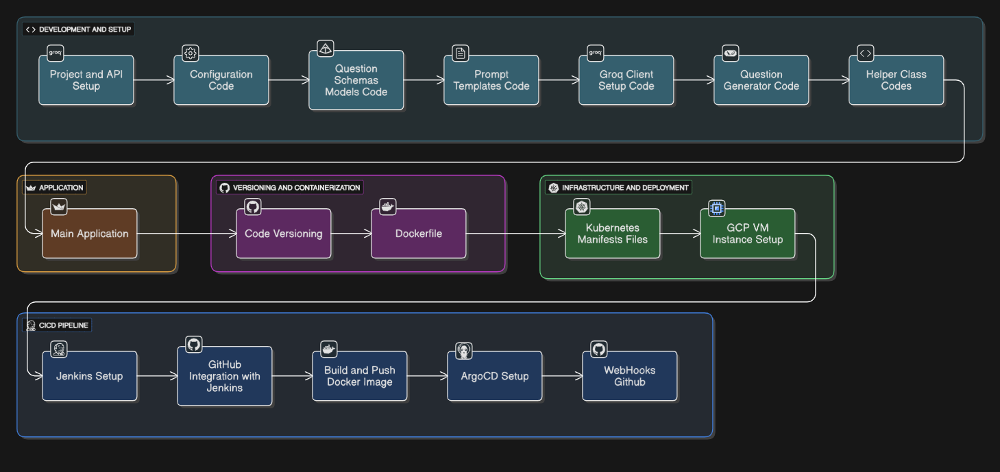

<h1 align="center">🚀 Aivana</h1>
<h3 align="center">LLMOps-Based AI Question Generation System</h3>

<p align="center">
An end-to-end production-ready AI system using LLMOps, Docker, Kubernetes, and CI/CD.
</p>

<p align="center">
  
</p>

## 📌 Overview

AIvana is an end-to-end **LLMOps-based AI application** designed to generate intelligent questions using Large Language Models.

It follows a complete production-grade pipeline including:
- Development & API Integration  
- Application Logic  
- Containerization  
- Cloud Deployment  
- CI/CD Automation  

---

## 🏗️ Architecture
Development & Setup → Application → Versioning & Containerization → Infrastructure & Deployment → CI/CD Pipeline

---

## ⚙️ Development & Setup

- **Project & API Setup** → Environment setup and API key configuration  
- **Configuration Code** → Centralized configuration management  
- **Question Schemas & Models** → Defines structure of generated questions  
- **Prompt Templates** → Predefined LLM prompts  
- **Groq Client Setup** → Handles LLM API communication  
- **Question Generator** → Core logic for question generation  
- **Helper Classes** → Utility and preprocessing functions  

---

## 💻 Application

- **Main Application**
  - Entry point of the system  
  - Connects all modules  
  - Handles user input/output  

---

## 📦 Versioning & Containerization

- **Code Versioning** → Git & GitHub  
- **Dockerfile** → Containerized application for consistent deployment  

---

## ☁️ Infrastructure & Deployment

- **Kubernetes Manifests**
  - Deployment configs  
  - Services & scaling  

- **GCP VM Instance**
  - Cloud hosting  
  - Runs application / cluster  

---

## 🔄 CI/CD Pipeline

- **Jenkins Setup** → Automation pipeline  
- **GitHub Integration** → Trigger builds on push  
- **Build & Push Docker Image**  
- **ArgoCD Setup** → GitOps deployment  
- **GitHub Webhooks** → Auto-trigger CI/CD  

---

## 🔁 Workflow

1. Code pushed to GitHub  
2. Webhook triggers Jenkins  
3. Docker image is built  
4. Image pushed to registry  
5. ArgoCD syncs deployment  
6. Kubernetes deploys app  

---

## 🛠️ Tech Stack

- **Python**
- **Groq API (LLM)**
- **Docker**
- **Kubernetes**
- **GCP**
- **Jenkins**
- **ArgoCD**
- **GitHub**

---


---

## 🚀 Getting Started

## 🚀 Clone Repository

🔗 [Open GitHub Repo](https://github.com/TanyaRoy1403/Aivana)

```bash
git clone https://github.com/TanyaRoy1403/Aivana.git
cd Aivana
pip install -r requirements.txt
Create a .env file in the root directory
GROQ_API_KEY=your_api_key_here

